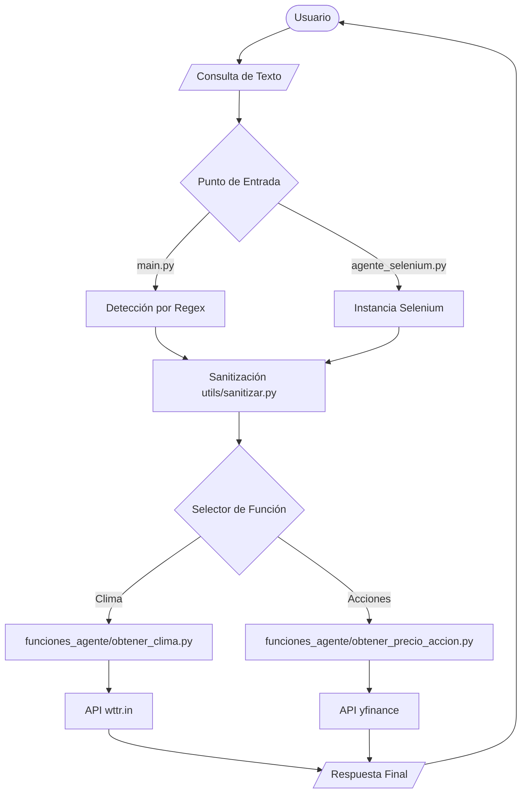

# Automatización Simple: Chatbot & Agente Virtual

Este proyecto es una herramienta de automatización modular escrita en Python que combina un chatbot de consola con capacidades de web scraping y consulta de APIs. Permite a los usuarios obtener información en tiempo real, como el precio de acciones y el clima, de manera sencilla y extensible.

## 🏗️ Arquitectura del Proyecto

El proyecto sigue un diseño **modular y basado en intenciones**, lo que facilita la adición de nuevas funcionalidades sin afectar el núcleo del sistema.



### Estructura del Proyecto

```text
automatizacion_simple/
├── agente_selenium.py      # Agente avanzado con Selenium
├── main.py                 # Chatbot básico por consola (Regex)
├── test_chatbot.py         # Scripts de prueba y validación
├── funciones_agente/       # Directorio de habilidades (Módulos)
│   ├── __init__.py
│   ├── obtener_clima.py    # Lógica de clima
│   └── obtener_precio_accion.py # Lógica de finanzas
├── utils/                  # Utilidades transversales
│   └── sanitizar.py        # Limpieza de lenguaje natural
├── .gitignore              # Archivos omitidos por Git
└── README.md               # Documentación general
```

### Detalles de la Arquitectura

La arquitectura de este proyecto se basa en tres principios fundamentales:

1.  **Modularidad (Habilidades Independientes)**: Cada función del agente (clima, acciones) reside en su propio archivo dentro de `funciones_agente/`. Esto permite desarrollar, probar y depurar cada habilidad de forma aislada sin riesgo de romper el resto del sistema.
2.  **Desacoplamiento del Frontend**: La lógica de negocio no depende de cómo se interactúa con el usuario. El mismo "cerebro" (`obtener_clima`) puede ser invocado desde una consola simple (`main.py`) o desde un navegador automatizado (`agente_selenium.py`).
3.  **Sanitización Centralizada**: El uso de un módulo de utilidades (`utils/`) asegura que el procesamiento de lenguaje natural sea consistente en todos los puntos de entrada, permitiendo que el sistema entienda variaciones de la misma pregunta.

### Flujo de Ejecución
1. **Entrada**: El usuario escribe una consulta (ej: "¿Cuál es el precio de Apple?").
2. **Detección de Intención**: El sistema identifica si se trata de clima, acciones o comandos de salida.
3. **Procesamiento (Sanitización)**: Se extrae la entidad relevante ("Apple") eliminando el ruido del lenguaje.
4. **Ejecución de Función**: Se invoca el módulo correspondiente pasándole el driver (si aplica) y el parámetro limpio.
5. **Respuesta**: Se devuelve el resultado formateado al usuario.

---

## 🚀 Cómo hacerlo Escalable

Para transformar este prototipo en un sistema de grado de producción, se recomiendan los siguientes cambios:

1.  **Uso de LLMs (GPT/Claude)**: En lugar de expresiones regulares y `sanitizar.py`, integrar una API de modelo de lenguaje para manejar la extracción de intenciones y entidades de forma mucho más robusta.
2.  **Base de Datos de Conocimiento (RAG)**: Implementar una base de datos vectorial para que el agente pueda consultar documentos locales o manuales.
3.  **Sistema de Plugins**: Crear una clase base abstracta para las funciones del agente, permitiendo que nuevas habilidades se carguen dinámicamente.
4.  **API Rest / Interfaz Web**: Migrar la lógica a un framework como **FastAPI** o **Flask** para ofrecer el servicio a través de una aplicación web o móvil.
5.  **Gestión de Sesiones**: Implementar persistencia para que el agente recuerde el contexto de conversaciones previas.

---

## 🛠️ Próximos Pasos Posibles

1.  **Nuevas Funciones**:
    *   `obtener_noticias`: Resumen de las noticias más importantes del día.
    *   `gestionar_calendario`: Integración con Google Calendar para añadir eventos.
    *   `traduccion_texto`: Traducción rápida entre idiomas.
2.  **Mejoras de Selenium**: Implementar búsquedas visuales en sitios que no tienen API pública.
3.  **Seguridad**: Añadir manejo de variables de entorno (`.env`) para claves de API sensibles.

---

## 📖 Documentación General

### Requisitos
*   Python 3.8+
*   Google Chrome (para el agente Selenium)
*   Librerías: `selenium`, `webdriver-manager`, `requests`, `yfinance`.

### Instalación
```bash
pip install -r requirements.txt
```

### Ejecución
Para el chatbot básico:
```bash
python main.py
```

Para el asistente con Selenium:
```bash
python agente_selenium.py
```
